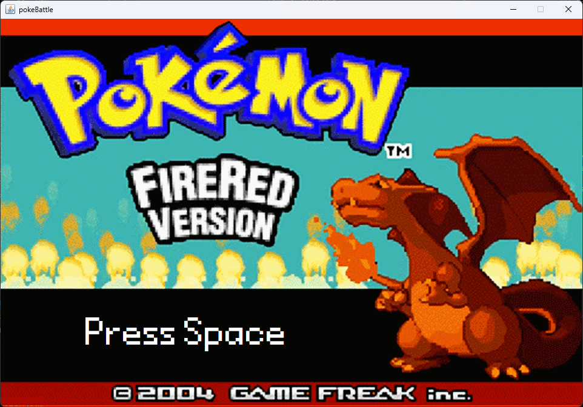
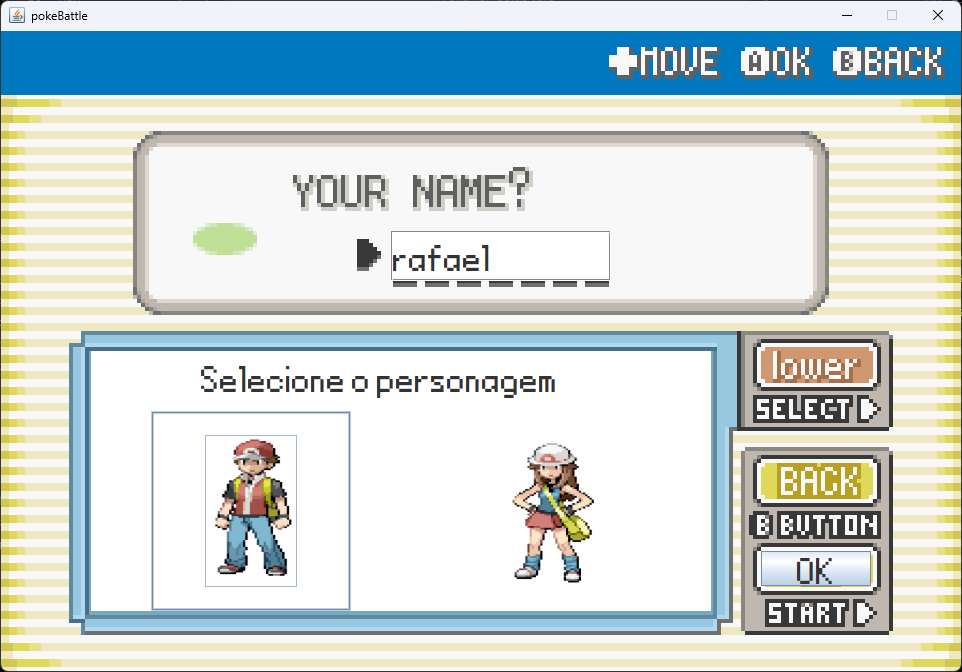
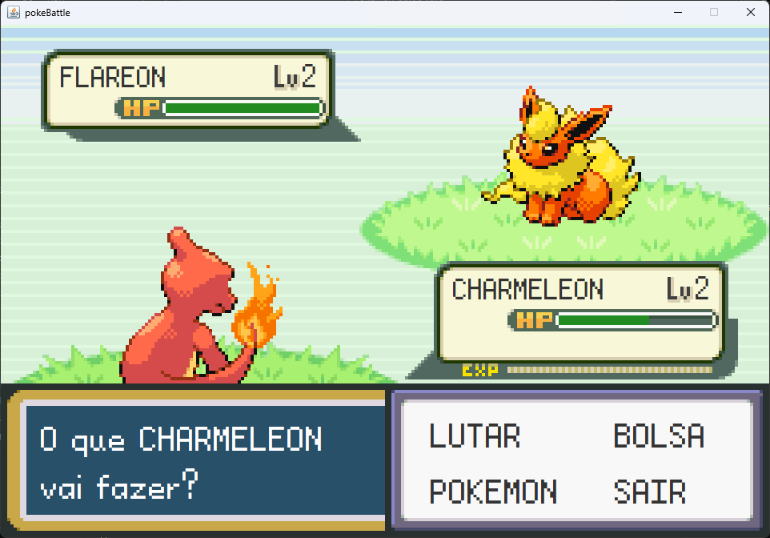
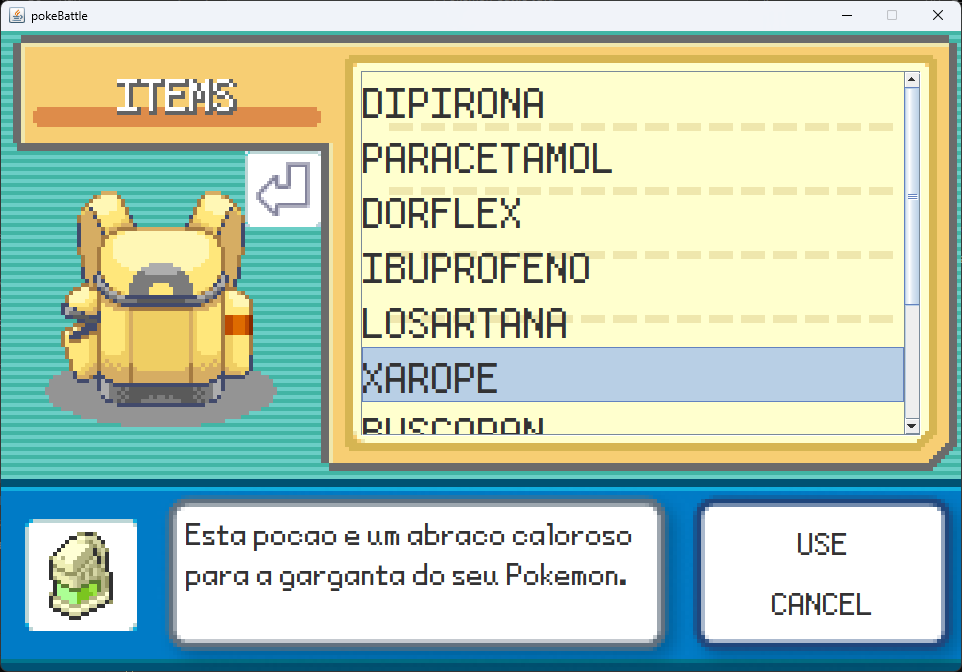

# Pokemon Battle Java Version

## Descrição

Esse projeto desenvolvido  como parte de um projeto acadêmico na disciplina de Programação Orientada a Objetos (POO). Este jogo de batalha Pokémon foi implementado em Java utilizando a biblioteca Swing, oferecendo uma experiência interativa e divertida para os fãs de Pokémon.

## Funcionalidades

- **Simulação de Batalha**: Divirta-se com batalhas empolgantes entre Pokémon, onde estratégia e habilidade são essenciais.
- **Interface Gráfica de Usuário (GUI)**: Uma tela fácil de usar feita em Java Swing, proporcionando uma experiência visual agradável.
- **Seleção de Pokémon**: Escolha seu Pokémon inicial favorito para participar da batalha e evoluir juntos, crescendo como treinador e Pokémon ao longo do jogo.
- **Personalização do Jogador**: Dê um nome ao seu personagem e personalize sua aparência para uma imersão completa no mundo Pokémon.
- **Itens de Cura**: Durante as batalhas, você pode usar itens de cura para manter seus Pokémon saudáveis e prontos para lutar.
- **Save e Load**: Salve o jogo para poder voltar e continuar mais tarde.

## Capturas de Tela

| | |
| --- | --- |
|  |  |
|  |  |

## Requisitos

Para utilizar o Pokemon Battle Simulator, você precisará ter instalado:

- **Java Development Kit (JDK)** 8 ou superior.
- **PowerShell** (para Windows) ou terminal equivalente.

## Instalação

Siga estas etapas simples para começar:

1. Clone o repositório para o seu ambiente local:
```bash
git clone https://github.com/rafaelfranca1/Pokemon-Battle-Java.git
cd Pokemon-Battle-Java
```

2. Baixe a biblioteca Gson (necessária para salvar/carregar partidas):
```powershell
Invoke-WebRequest -Uri "https://repo1.maven.org/maven2/com/google/code/gson/gson/2.10.1/gson-2.10.1.jar" -OutFile "gson-2.10.1.jar"
```

## Como Jogar

### Compilar e Executar

1. Compile todos os arquivos Java:
```powershell
javac -cp ".;gson-2.10.1.jar" *.java
```

2. Execute o jogo:
```powershell
java -cp ".;gson-2.10.1.jar" Main
```

### Controles

- **Mouse**: Clique nos botões e opções
- **Tecla SPACE**: Avança diálogos e mensagens de batalha
- **Clique no texto**: Também avança mensagens durante as batalhas

### Gameplay

1. Crie seu personagem e escolha seu nome
2. Selecione seu Pokémon inicial (Bulbasaur, Charmander ou Squirtle)
3. Batalhe contra diversos Pokémon inimigos
4. Use ataques e itens de cura estrategicamente
5. Evolua seu Pokémon conforme ganha experiência
6. Salve seu progresso ao sair do jogo

## Autores

Conheça os desenvolvedores por trás do Pokemon Battle Simulator:

- [João Marcos](https://github.com/j4marcos)
- [Puca Vaz](https://github.com/pucaVaz)
- [Rafael de França](https://github.com/rafaelfranca1)

## Agradecimentos

Agradecemos a professora responsável pela disciplina de Programação Orientada a Objetos por orientar e apoiar o desenvolvimento deste projeto.
